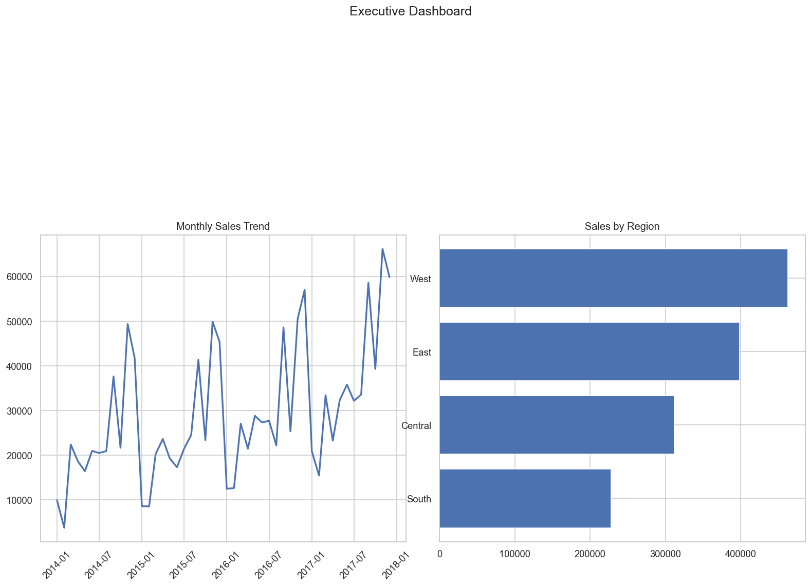
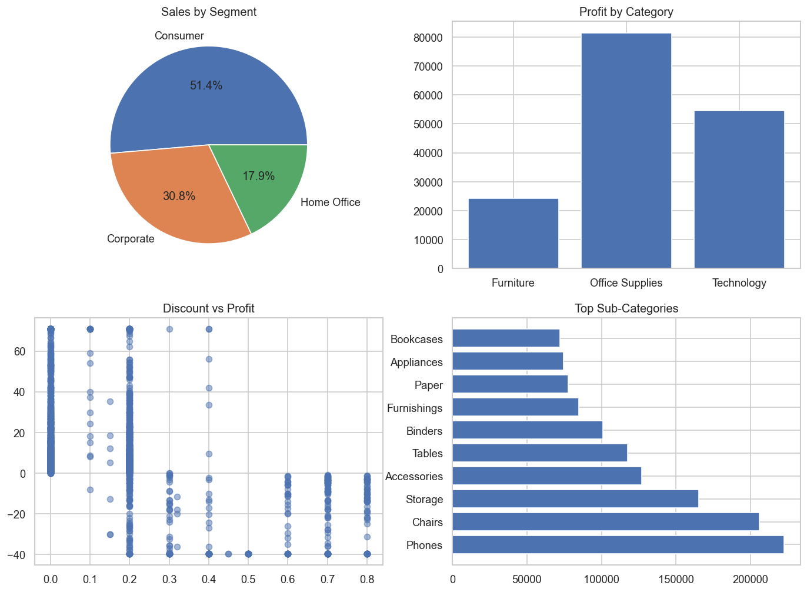
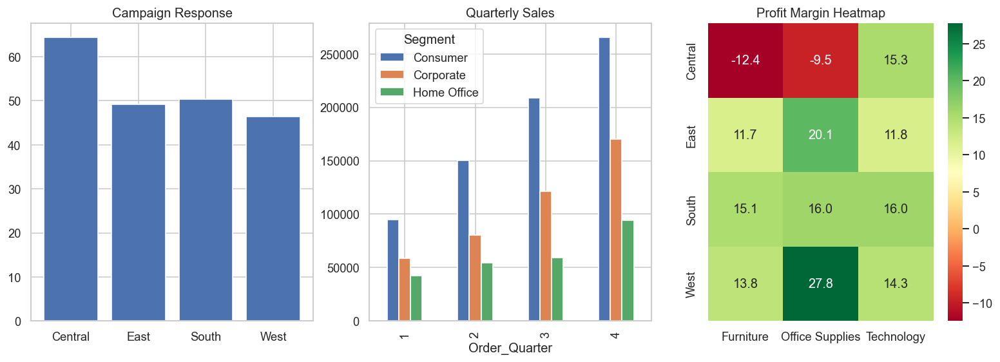

# Campaign Performance Analytics & Sales Dashboard

> End-to-end campaign analytics project — data cleaning, performance analysis,
> and interactive dashboards built with Python, Pandas, Matplotlib, and Seaborn.

---

## 📊 Project Overview

This project analyzes **10,000+ sales records** to evaluate campaign performance
trends, identify top-performing customer segments and regions, and measure the
impact of discount campaigns on revenue and profit margins.

Built to mirror the real-world workflow of a campaign analytics role in a
retail banking / marketing environment.

---

## 🎯 Key Findings

| Metric | Value |
|---|---|
| Total Revenue Analyzed | $2.3M+ |
| Top Customer Segment | Consumer (51% of sales) |
| Highest Revenue Region | West |
| Campaign Order Rate | ~51% of all orders |
| Best Performing Category | Technology |
| Profit Erosion Alert | Discounts above 30% → negative margins |

---

## 📈 Dashboards

### Dashboard 1 — Executive Summary


### Dashboard 2 — Segment & Category Analysis


### Dashboard 3 — Campaign Response & Heatmap


---

## 🗂️ Project Structure

```
campaign-performance-analytics/
├── data/
│   ├── sales_data.csv           ← Raw dataset (Superstore)
│   └── sales_data_clean.csv     ← Cleaned dataset
├── 01_eda.py                    ← Exploratory Data Analysis
├── 02_cleaning.py               ← Data cleaning & feature engineering
├── 03_analysis.py               ← Campaign performance analysis
├── 04_dashboard.py              ← Dashboard visualizations
└── README.md
```

---

## 🔧 Tech Stack

| Tool | Purpose |
|---|---|
| Python 3.x | Core language |
| Pandas | Data manipulation and analysis |
| NumPy | Numerical operations |
| Matplotlib | Chart and dashboard creation |
| Seaborn | Statistical visualizations |
| Excel / CSV | Data source format |

---

## 🚀 How to Run

```bash
# 1. Clone the repo
git clone https://github.com/tensakuro/campaign-performance-analytics
cd campaign-performance-analytics

# 2. Install dependencies
pip install pandas numpy matplotlib seaborn openpyxl

# 3. Add the dataset
# Download from Kaggle: Superstore Sales Dataset
# Save as: data/sales_data.csv

# 4. Run in order
python 01_eda.py
python 02_cleaning.py
python 03_analysis.py
python 04_dashboard.py
```

---

## 📋 Analysis Steps

### Step 1 — EDA
- Loaded and profiled 10,000+ records
- Identified data types, null values, and statistical distributions
- Generated campaign snapshot: total revenue, orders, customer count

### Step 2 — Data Cleaning
- Converted date columns to datetime format
- Extracted time features: year, month, quarter, delivery days
- Removed duplicates and handled missing values
- Engineered new features: Profit Margin %, Revenue per Unit, Campaign flag

### Step 3 — Campaign Analysis
- Compared campaign vs non-campaign order performance
- Analyzed sales and profit by customer segment, region, and category
- Measured discount impact across 6 discount bands
- Identified monthly and quarterly trends

### Step 4 — Dashboard
- Built 3 multi-chart dashboards with KPI cards
- Visualized monthly trends, regional performance, discount scatter
- Created profit margin heatmap (Region × Category)

---

## 💡 Business Insights

1. **Discount campaigns hurt margins** — orders with 31%+ discounts
   generate negative average profit. Campaigns should cap at 20%.

2. **West region leads revenue** but Central has the highest profit margin —
   campaign spend should be rebalanced toward Central.

3. **Technology category** drives the highest profit despite fewer orders —
   a prime target for focused campaign investment.

4. **Consumer segment** accounts for 51% of sales but Corporate has a
   higher average order value — upsell campaigns should target Corporate.

---

## 👤 Author

**Sohel Mahammad**
- LinkedIn: [linkedin.com/in/sohelmahammad96](https://linkedin.com/in/sohelmahammad96)
- GitHub: [github.com/tensakuro](https://github.com/tensakuro)
- Email: sohel.tensa@gmail.com

---

## 📄 Dataset Source

[Superstore Sales Dataset — Kaggle](https://www.kaggle.com/datasets/vivek468/superstore-dataset-final)
